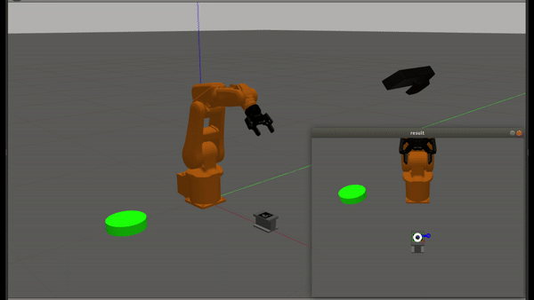
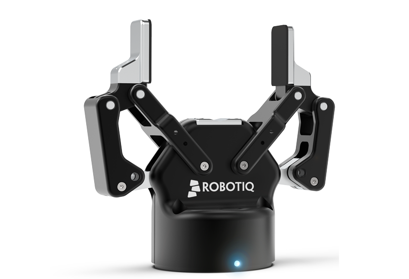

# Robot Arm 
#### An industrial robot arm tasked to detect and pick an item to the desired place.

   

#### The project consists of the following components:
1. ABB irb120 arm.
2. robotiq 2F-85 gripper.
3. Microsoft Kinect camera.

  
   
  

#### Task details:
1. Detect an object using an Aruco marker.
2. Send object coordinates to the robot arm.
3. Robot arm picks the object.
4. Robot arm places the object over the green base.

#### Software:
- moveit planner: provides the IK engine, action library, and control.
- gazebo grasp plugin: solves Gazebo physics issues when grabbing an item (https://github.com/JenniferBuehler/gazebo-pkgs)
- Opencv: used to detect the Aruco marker

#### Acknowledgment:
- https://github.com/JdeRobot/IndustrialRobots (The URDF files)
- https://www.youtube.com/watch?v=_flpwM8yyVM (Aruco marker detection)
